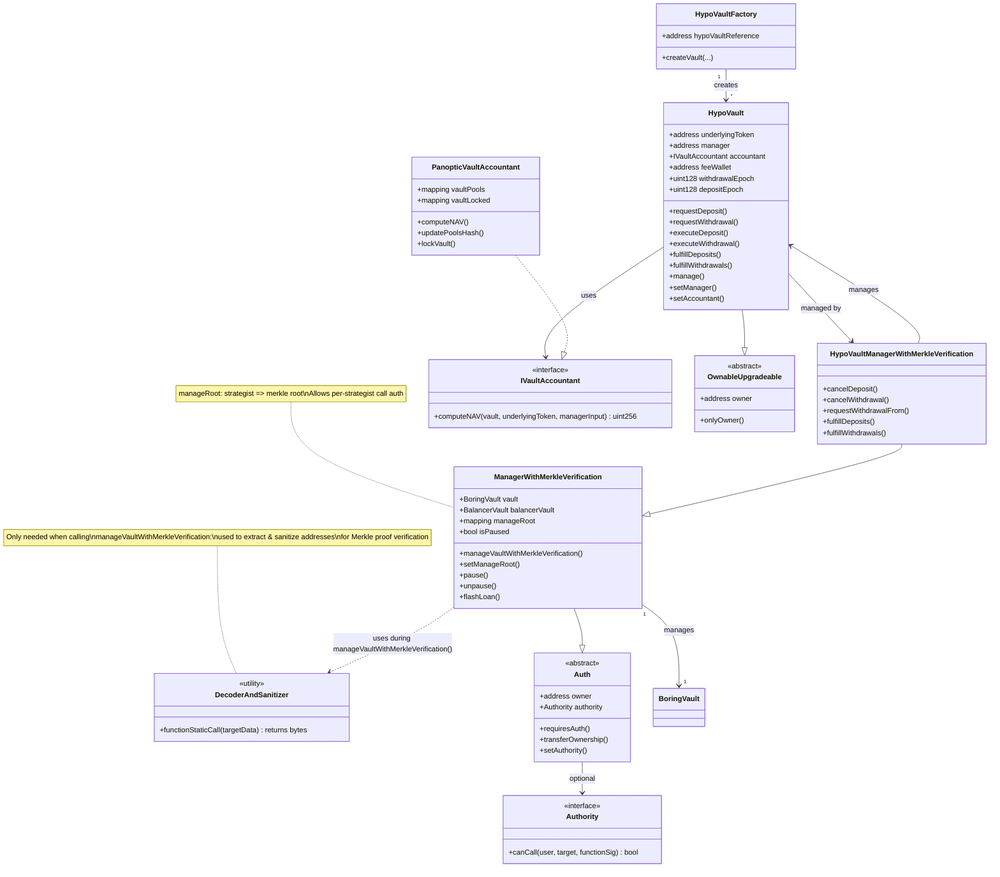
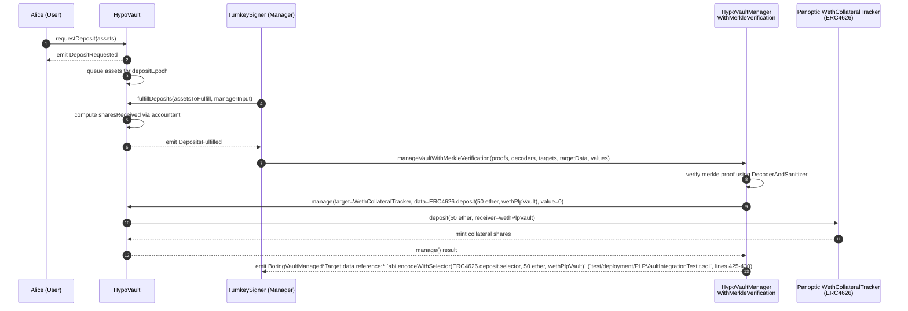
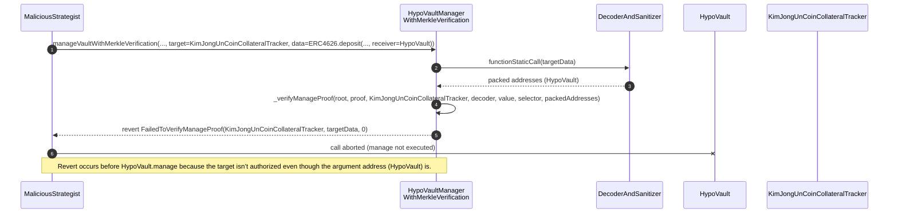
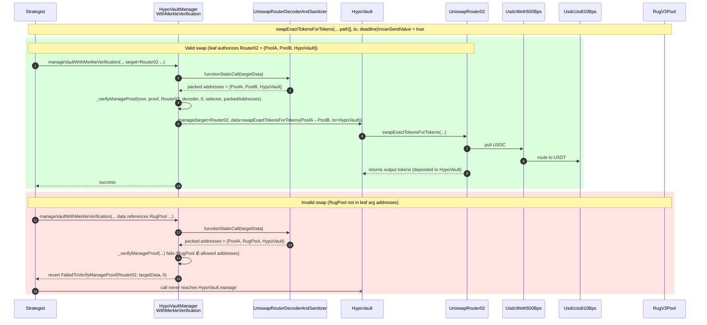

## The HypoVault

The HypoVault is a smart contract that accepts funds from depositors and allows managers, permissioned by the HypoVaultManagerWithMerkleVerification, to interact with a limited set of addresses and functions using those funds. It uses asynchronous deposits and withdrawals to control the flow of funds, where managers are incentivized to take action & fulfill your deposit or withdrawal.

Managers work with Accountant contracts to help each HypoVault arrive at a NAV and determine the share price credited to deposits & withdrawals. An Accountant specific to Panoptic can be found at `src/accountants/PanopticVaultAccountant.sol`.

The HypoVault architecture is based on the thoroughly audited smart contract suite for vault infrastructure built by [Veda](https://veda.tech/). Instantiations of their smart contracts manage over 2 Billion in assets across DeFi and have been used by 100K+ unique accounts.

More information can be found at the (in-progress) docs here: https://docs-git-feat-vault-section-panoptic.vercel.app/docs/vaults/overview

## Diagrams

The following diagrams illustrate how we modified the vault architecture to suit Panoptic's options vaults, and how the core security guarantees of `ManagerWithMerkleVerification` protect depositors from malicious vault manager actions.

> The charts can be viewed in VSCode using the "Mermaid Chart" extension, or in the browser by copying and pasting the chart code into https://mermaid.live/, or https://excalidraw.com/ with Excalidraw's Mermaid -> Excalidraw feature.

### HypoVault Architecture Class Diagram

A selection of important contracts in the HypoVault architecture:



### HypoVault Deposit & Manage Sequence Diagrams

An example of async deposit flow through the HypoVault, followed by a manager depositing the user's assets in a CollateralTracker to earn yield.

When viewing the manage flows, it's useful to keep in mind the structure of the leaves which create the merkle root:

```solidity
struct ManageLeaf {
  address target; // contract being called
  bool canSendValue; // whether the call is allowed to forward native assets
  string signature; // (a.k.a selector) human-readable function signature
  address[] argumentAddresses; // sanitized address args extracted from calldata
  string description; // helper metadata when exporting trees to JSON
  address decoderAndSanitizer; // bespoke helper that extracts & sanitizes addresses for this target/signature
}
```

> This structure can be observed in the function `ManagerWithMerkleVerification._verifyManageProof`, and the struct is defined explicitly in the `MerkleTreeHelper` contract, which is used to build merkle roots and export a human-readable merkle tree to a JSON file for managers to build valid calls.

The following sequence diagrams are simplified to help you get your bearings on how the vault architecture works. They assume a single merkle root consisting of a single merkle leaf, and a single manager. In practice, there can be many merkle roots, many managers, and many leaves per merkle root. Additionally, the merkle roots can be updated by accounts specified using the Authority contract shown in the class diagram above. These details are not shown.

#### Happy Path – Deposit Request & Manage call to deposit to Collateral Tracker

Merkle tree configuration for this flow:

- target: `WethCollateralTracker`
- decoder/sanitizer: `CollateralTrackerDecoderAndSanitizer`
- signature: `ERC4626.deposit(uint256 assets, address receiver)`
- canSendValue: `false`
- argument addresses: `{HypoVault}`



#### Bad Path – Manager attempts to call an unauthorized target

Merkle tree configuration for this flow:

- target: `WethCollateralTracker`
- decoder/sanitizer: `CollateralTrackerDecoderAndSanitizer`
- signature: `ERC4626.deposit(uint256 assets, address receiver)`
- canSendValue: `false`
- argument addresses: `{HypoVault}`



### Mixed Path – Manager calls allowed target with allowed argument addresses, then disallowed argument addresses

Merkle tree configuration for this flow:

- target: `UniswapRouter02`
- decoder/sanitizer: `UniswapRouterDecoderAndSanitizer`
- signature: `swapExactTokensForTokens(uint amountIn, uint amountOutMin, address[] calldata path, address to, uint deadline)`
- canSendValue: `true`
- argument addresses: `{UsdcWeth500Bps, UsdcUsdt10Bps, HypoVault}`



## Roles

| Role | Account | Can Do |
|------|---------|--------|
| HypoVault Owner | Turnkey0 (later multisig) | Update manager, accountant, and fee wallet |
| RolesAuthority Owner | Turnkey0 (later multisig) | Configure roles and permissions; call `setManageRoot()` on ManagerWithMerkleVerification |
| PanopticVaultAccountant Owner | Turnkey0 (later multisig) | Call `updatePoolsHash()` and `lockVault()` |
| RolesAuthority.Strategist | Turnkey1/2/3 (1 per vault) | Call `manageVaultWithMerkleVerification()` (uses `requiresAuth` modifier) |
| HypoVaultManager.onlyStrategist | Turnkey1/2/3 (1 per vault) | Call `fulfillDeposits()`, `fulfillWithdrawals()`, `cancelDeposit()`, `cancelWithdrawal()`, `requestWithdrawalFrom()` |

### Notes

- Each vault uses **one dedicated Turnkey account** (e.g., Turnkey1 for WETH vault, Turnkey2 for USDC vault)
- The RolesAuthority Owner can call `setManageRoot(strategist, merkleRoot)` to authorize strategists
- The `onlyStrategist` modifier allows any address with a manageRoot OR the owner
- In practice, the same Turnkey account receives both the RolesAuthority.Strategist role and a manageRoot for full vault management capabilities

## Adapting to new Protocols

For each new protocol a vault will want to interact with, there will need to be an appropriate DecoderAndSanitizer (or multiple DecoderAndSanitizers), as well as an accountant (like PanopticVaultAccountant). See more in the BoringVault docs here: https://docs.veda.tech/integrations/boringvault-protocol-integration

## Commands

### Build

```shell
$ forge build
```

### Test

```shell
$ forge test
```

### Format

```shell
$ forge fmt
```

### Gas Snapshots

```shell
$ forge snapshot
```

### Deploy via EOA

To deploy with an EOA on Sepolia...

1. Ensure you .env is up to date:

```sh
PRIVATE_KEY=<private key>
ETHERSCAN_API_KEY=<your etherscan key>
ALCHEMY_API_KEY=<your alchemy key>
```

2. Copy the deployment script and rename it to describe the vault you want to deploy. This ensure each vault deployment is stored in version control to look back later if we need it for anything (like to regenerate the merkle tree containing allowlisted functions).

3. From the root of the repo, run

```
source .env && forge script --sender <sender for the private key in your env> --rpc-url https://eth-sepolia.g.alchemy.com/v2/${ALCHEMY_API_KEY} script/<your_deployment_script>.s.sol -vvvv --broadcast --verify --slow`
```

> NOTE: Using a private key in a .env is not suitable for production. Forge script accepts the --turnkey option for deploying via Turnkey if we'd like to do an EOA deploy while maintaining high security guarantees.

4. Double check the addresses are correct inside the script
   The PanopticMultisig is: `0x82BF455e9ebd6a541EF10b683dE1edCaf05cE7A1`
   The Turnkey manager account is not used in another vault script. Each vault will need a unique manager account.

5. Commit your new script and the `.json` file that was written in the `hypoVaultManagerArtifacts/` directory and push to a branch on GitHub.
