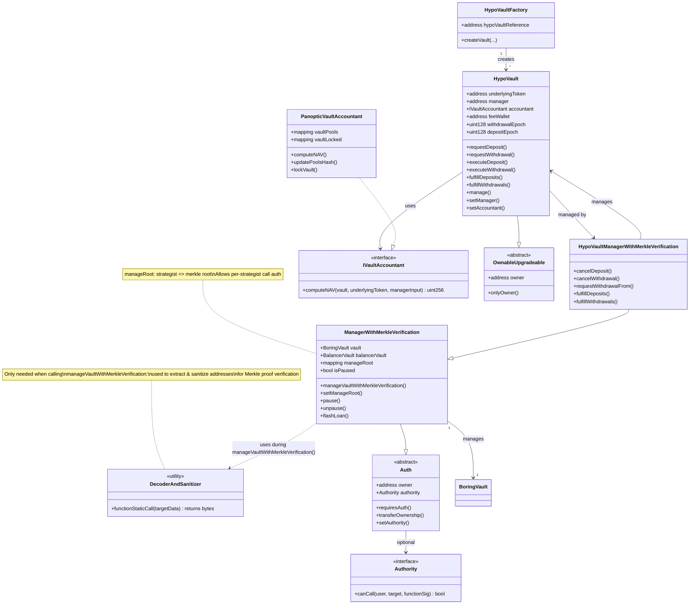
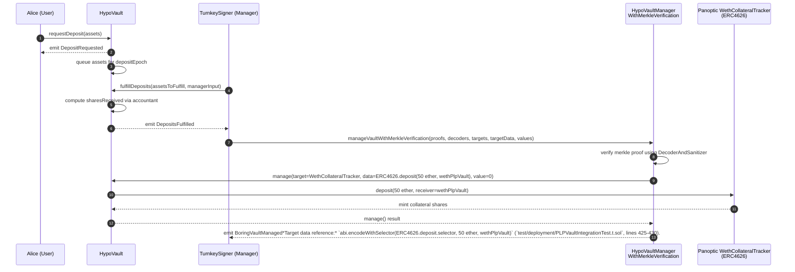
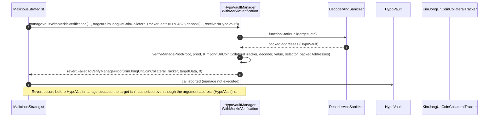
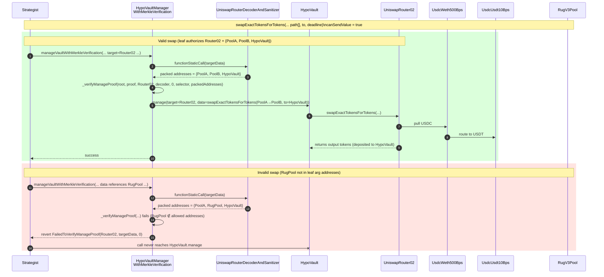

# Overview

The `HypoVault` is based on DeFi thoroughly audited smart contract suite for vault infrastructure built by [Veda](https://veda.tech/). Instantiations of their smart contracts manage over 2 Billion in assets across DeFi and have been used by 100K+ unique accounts.

Our innovation has been the `HypoVault`, which allows for asynchronous deposits and withdrawals, while maintaining the core security guarantees of the rest of Veda's vault architecture. The core security guarantees come from a specific contract, `ManagerWithMerkleVerification`.

The following diagrams illustrate how we modified the vault architecture to suit Panoptic's options vaults, and how the core security guarantees of `ManagerWithMerkleVerification` protect depositors from malicious vault manager actions.

> The charts can be viewed in VSCode using the "Mermaid Chart" extension, or in the browser by copying and pasting the chart code into https://mermaid.live/, or https://excalidraw.com/ with Excalidraw's Mermaid -> Excalidraw feature.

## HypoVault Architecture Class Diagram

A selection of important contracts in the HypoVault architecture:



## HypoVault Deposit & Manage Sequence Diagrams

An example of async deposit flow through the HypoVault, followed by a manager depositing the user's assets in a CollateralTracker to earn yield.

When viewing the manage flows, it's useful to keep in mind the structure of the leaves which create the merkle root:

```solidity
struct ManageLeaf {
  address target; // contract being called
  bool canSendValue; // whether the call is allowed to forward native assets
  string signature; // (a.k.a selector) human-readable function signature
  address[] argumentAddresses; // sanitized address args extracted from calldata
  string description; // helper metadata when exporting trees to JSON
  address decoderAndSanitizer; // bespoke helper that extracts & sanitizes addresses for this target/signature
}
```

> This structure can be observed in the function `ManagerWithMerkleVerification._verifyManageProof`, and the struct is defined explicitly in the `MerkleTreeHelper` contract, which is used to build merkle roots and export a human-readable merkle tree to a JSON file for managers to build valid calls.

The following sequence diagrams are simplified to help you get your bearings on how the vault architecture works. They assume a single merkle root consisting of a single merkle leaf, and a single manager. In practice, there can be many merkle roots, many managers, and many leaves per merkle root. Additionally, the merkle roots can be updated by accounts specified using the Authority contract shown in the class diagram above. These details are not shown.

### Happy Path – Deposit Request & Manage call to deposit to Collateral Tracker

Merkle tree configuration for this flow:

- target: `WethCollateralTracker`
- decoder/sanitizer: `CollateralTrackerDecoderAndSanitizer`
- signature: `ERC4626.deposit(uint256 assets, address receiver)`
- canSendValue: `false`
- argument addresses: `{HypoVault}`



### Bad Path – Manager attempts to call an unauthorized target

Merkle tree configuration for this flow:

- target: `WethCollateralTracker`
- decoder/sanitizer: `CollateralTrackerDecoderAndSanitizer`
- signature: `ERC4626.deposit(uint256 assets, address receiver)`
- canSendValue: `false`
- argument addresses: `{HypoVault}`



### Mixed Path – Manager calls allowed target with allowed argument addresses, then disallowed argument addresses

Merkle tree configuration for this flow:

- target: `UniswapRouter02`
- decoder/sanitizer: `UniswapRouterDecoderAndSanitizer`
- signature: `swapExactTokensForTokens(uint amountIn, uint amountOutMin, address[] calldata path, address to, uint deadline)`
- canSendValue: `true`
- argument addresses: `{UsdcWeth500Bps, UsdcUsdt10Bps, HypoVault}`


